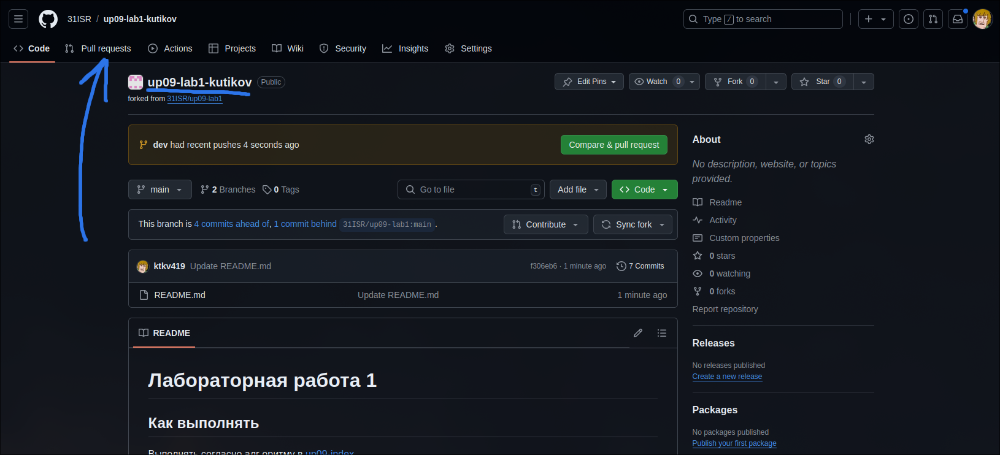
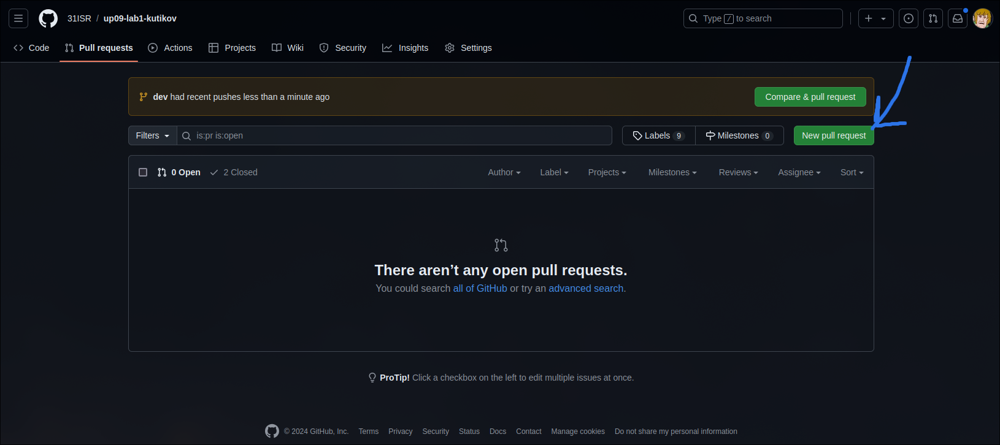
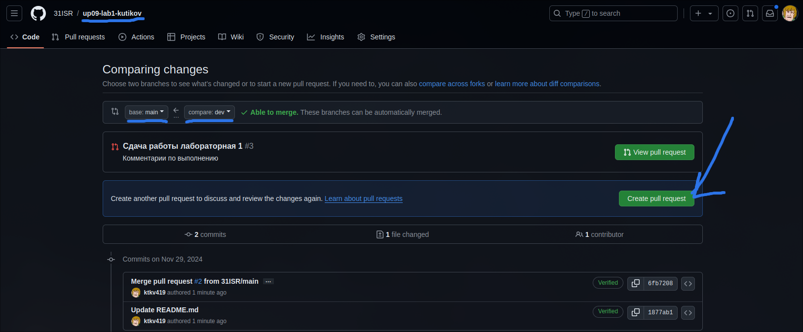
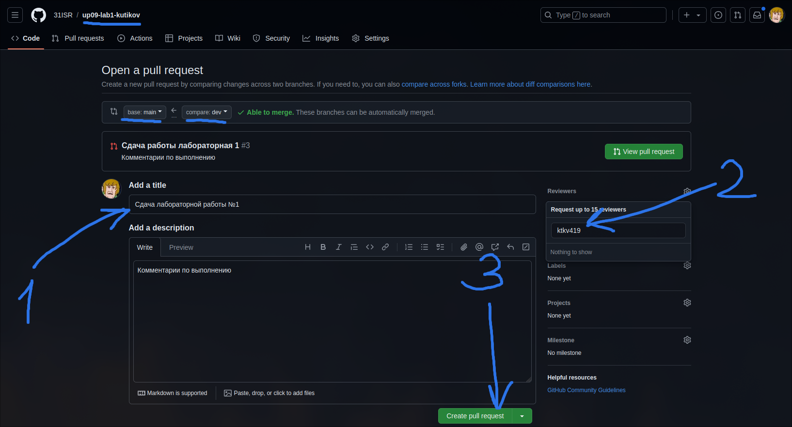
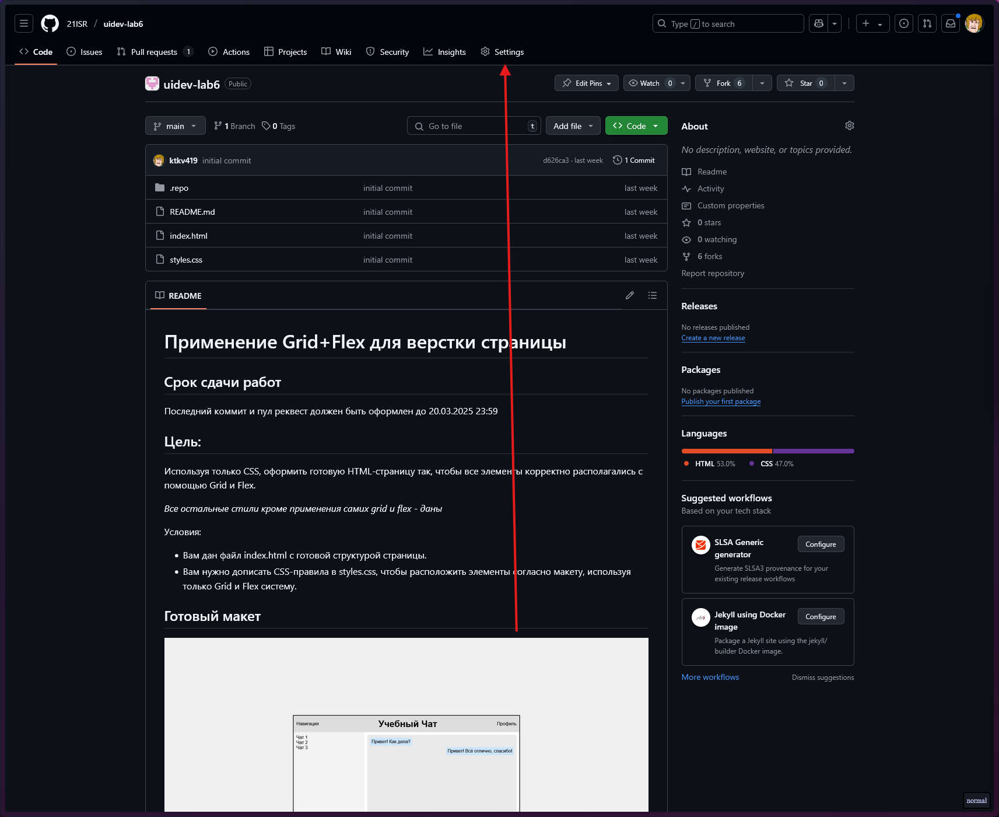
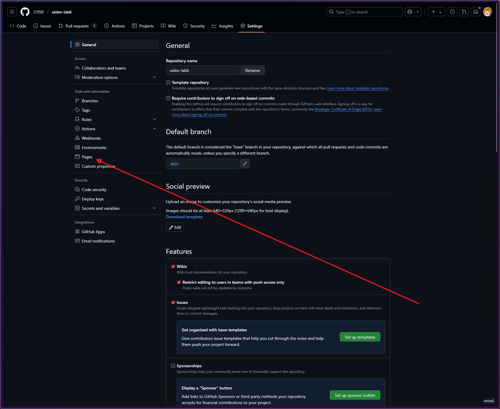
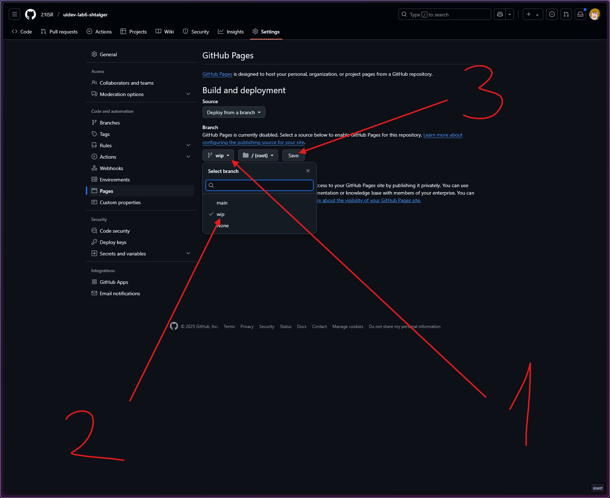
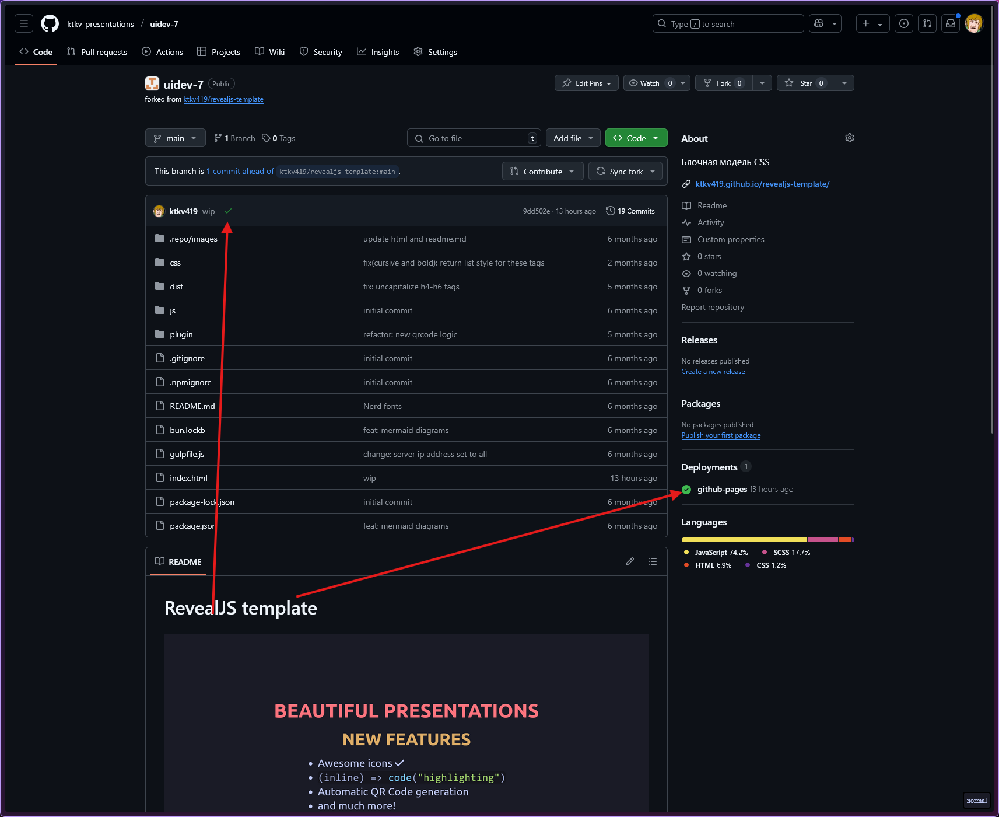
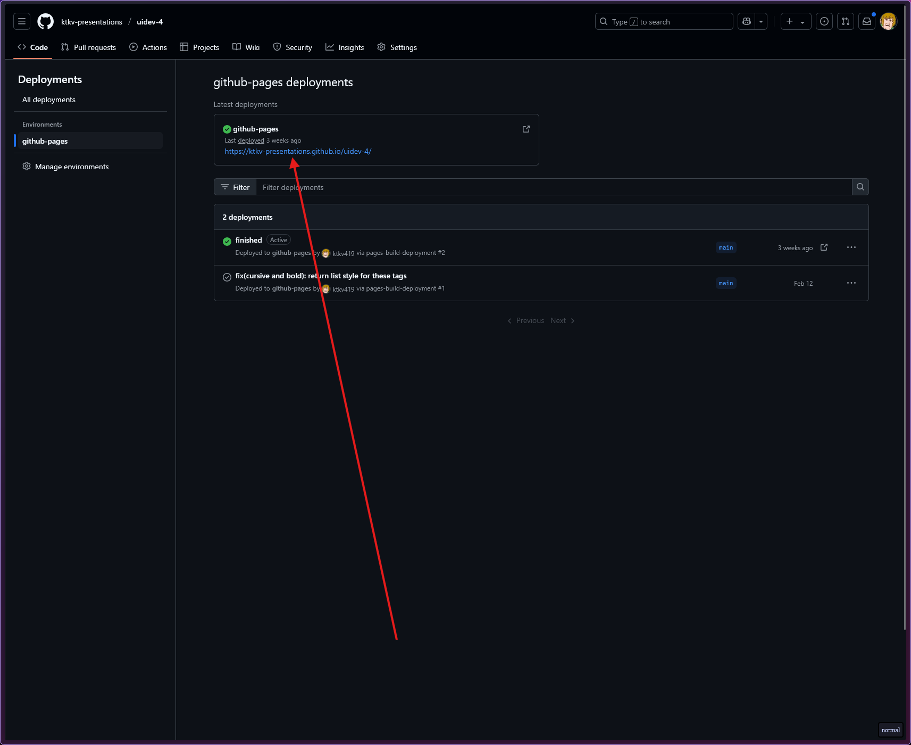

# Мобильная разработка

## Содержание

1. [Лидерборд](https://docs.google.com/spreadsheets/d/1Dnll6qAerhpAkDqgpXH0BbgAOyp0m6Mg/edit?usp=sharing&ouid=114980174016056670914&rtpof=true&sd=true)
1. [Roadmap](#roadmap)
1. [Как выполнять задания](#как-выполнять-задания)
1. [Документация](#документация)
1. [Полезное](#полезное)

## Roadmap

Все, что находится выше `Мы здесь` должно быть у вас для успешного получения зачета

### 0. Git

[Презентация по Git](https://ktkv-presentations.github.io/algos-8/)

[Интерактивный тренажер по Git](https://ohmygit.org/)

[Лабораторная работа](https://github.com/31ISP/mobdev-lab-git)

### 1. Введение в верстку

#### 1. HTML

[Презентация по HTTP](https://ktkv-presentations.github.io/uidev-1)

[Презентация по HTML](https://ktkv-presentations.github.io/uidev-3)

[HTML Academy #1](https://htmlacademy.ru/courses/297/)

[HTML Academy #2](https://htmlacademy.ru/courses/299)

[Лабораторная работа](https://github.com/31ISP/mobdev-lab-html)

#### 2. JS

- [Лекция](https://ktkv-presentations.github.io/uidev-11/#/1/1)

- [Лабораторная работа #1](https://github.com/31ISP/mobdev-js-lab)

- [Лабораторная работа (Fetch) #3](https://github.com/31ISP/mobdev-render-lab)

### 3. Основы React

- [Памятка React](https://github.com/31ISP/mobdev3-react)

#### Пропсы и компоненты

- [Классная](https://github.com/41ISP/mobdev-props)

- [Лабораторная](https://github.com/41ISP/webdev-props-lab)

#### Хуки

- [Классная](https://github.com/41ISP/mobdev-hooks)

- [Лабораторная](https://github.com/41ISP/mobdev-hooks-lab)

## Как выполнять задания

В каждом репозитории описано как выполнять задание. В случае, если не указано, то работать по следующему принципу:

### Как начать выполнять

1. Создайте fork репозитория в этой организации под названием `изначальное_название_репозитория-вашафамилия`

2. Переключитель на ветку `dev` или `wip` (левый-верхний угол)

3. Запустите Codespace (Code => Codespace)

_Либо запускайте сразу на нужной ветке, либо переключайтесь в терминале кодспейса_

### Как сохранять работу

Для отправки ветки `dev` или `wip` на репозиторий GitHub необходимо:

- Добавить все измененные файлы в следующий коммит `git add .`

_Обратите внимание, что `.` это текущая папка. Соответственно, если вы находитесь в какой-либо папке внутри репозитория, то будут добавлены изменения только из папки_

- Создайте коммит `git commit -m "{Что делали}"`

_В кавычках постарайтесь описать что вы делали в текущем коммите, особенно если работа у вас заняла больше 1 коммита_

- Отправить коммит на GitHub `git push -u origin dev`

_Обратите внимание на последнее слово - это название вашей ветки_

### Сдача лабораторных работ

При успешном выполнении задания:

- Делайте коммит
- Захостите работу с помощью [Github Pages](#как-хостить-работу)
*Проверьте, что на Pages все работает так, как в задумывали*
- Добавляйте [pull request](#как-делать-pull-request) из `dev` в `main` в **вашем репозитории**
- Указывайте меня ([ktkv419](https://github.com/ktkv419)) как reviewer
- *Если работу закончили на паре - покажите мне, я сразу дам комментарии по поводу выполнения*

При успешной сдаче задания pull request будет закрыт и последним сообщением перед закрытием реквеста будут написаны мои комментарии и оценка

### Как делать pull request

_Обратите внимание, что это делается в **вашем** репозитории, где вы работали_

1. Откройте вкладку Pull requests

<p align="center">
    
</p>

2. Создайте новый PR

<p align="center">
    
</p>

3. Перепроверье, что изменения сливаются из ветки `dev` (справа) в ветку `main` (слева) и создайте новый PR

<p align="center">
    
    
</p>

В случае успешной сдачи работы вы увидите мои комментарии по поводу работы, оценку и что реквест был слит с веткой main

### Как хостить работу

_Обратите внимание, что это делается в **вашем** репозитории, где вы работали_

1. Откройте настройки проекта и вкладку `Pages`

<p align="center">
    
</p>

<p align="center">
    
</p>

2. Укажите ветку в которой вы выполняли работу и нажмите сохранить

_чаще всего это либо `dev`, либо `wip`_

<p align="center">
    
</p>

3. Удостоверьтесь, что работа была захосчена успешно

_об этом будет сигнализировать галочки у последнего коммита и в категории `Deployments`, также удостоверьтесь, что работа доступна по ссылке внутри деплоя `github-pages`_

<p align="center">
    
</p>

<p align="center">
    
</p>

### Как хостить React работу

1. Установите пакет `gh-pages` как зависимость разработчика

```bash
npm i -D gh-pages
```

2. Укажите название репозитория в файле `vite.config.js`

```js
import { defineConfig } from 'vite'
import react from '@vitejs/plugin-react'

// https://vite.dev/config/
export default defineConfig({
  plugins: [react()],
  base: '/название_репозитория/'
})
```

3. Добавьте `basepath` в `router`

_Этот шаг выполняется только если в работе присутствует `react-router-dom`_

```jsx
const router = createBrowserRouter(
  [
    ...
  ],
  {
    basename: "/название_репозитория"
  }
)
```

5. Добавьте скрипт в `package.json`

```json
"deploy": "npm run build && npx gh-pages -d dist -f"
```

5. Запустите скрипт

```bash
npm run deploy
```

#### Если что-то пошло не так и надо перехостить

```bash
git push origin --delete gh-pages
git branch -D gh-pages
npm run deploy
```

_Удаляем ветку и заново деплоим_

## Документация/Полезное

- [MDN - официальная документация HTML/CSS/JS](https://developer.mozilla.org/ru/docs/Web/)
- [Дока - более практическая документация](https://doka.guide/)
- [Git шпаргалка](https://github.com/cyberspacedk/Git-commands)

